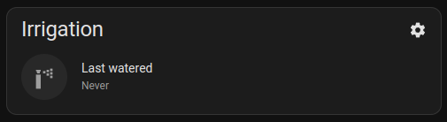
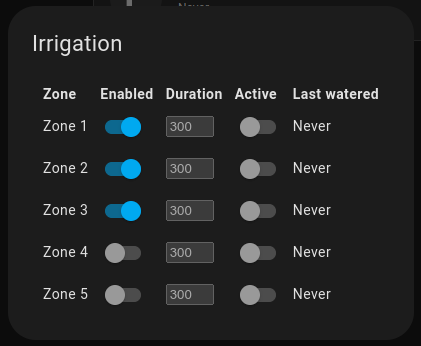

# Sprinklers Card

A custom card to manage ESPHome's Sprinkler controllers from your Home Assistant.





## Setup

We recommend using HACS:

[](https://my.home-assistant.io/redirect/hacs_repository/?owner=mancontr&repository=sprinklers-card&category=plugin)

## Configuration

If you haven't already, begin by setting up your [Sprinkler Controller](https://esphome.io/components/sprinkler.html) using ESPHome.

To add the card into your panel, add a custom YAML card of type `custom:sprinklers-card`.

Example configuration:

```yml
type: custom:sprinklers-card
general:
  switch: switch.sprinklers_sprinklers
  multi: number.sprinklers_sprinklers_multiplier
valves:
  - name: Zone 1
    duration: number.sprinklers_zone_1_duration
    enabled: switch.sprinklers_zone_1_enabled
    switch: switch.sprinklers_zone_1
  - name: Zone 2
    duration: number.sprinklers_zone_2_duration
    enabled: switch.sprinklers_zone_2_enabled
    switch: switch.sprinklers_zone_2
```

A comprehensive list of available options is provided below:

| Field          | Required | Description |
|----------------|----------|-------------|
| title          | No       | Set a custom title for the card. |
| colTitles      | No       | Override the modal column titles. |
| general.switch | Yes      | The "Main Switch" device. |
| general.multi  | No       | The "Multiplier Number" device. |
| valves         | Yes      | A list of the existing valves. See below for details. |

For each valve, the following options can be set:

| Field          | Required | Description |
|----------------|----------|-------------|
| name           | No       | Set the name for the valve. |
| duration       | Yes      | The "Run Duration Number" device for this valve. |
| enabled        | Yes      | The "Enable Switch" device for this valve. |
| switch         | Yes      | The "Valve Switch" device for this valve. |

## Usage

The card provides information about the controller's status.
When an irrigation run is in progress, it displays the currently active zone.
Otherwise, it shows the time of the last completed run.

You can manually initiate or halt a cycle by clicking on the sprinkler icon.

By clicking on the cog icon, a popup will appear, revealing the status of each valve.
This includes information about whether the valve is currently enabled and the time of its last activity.
